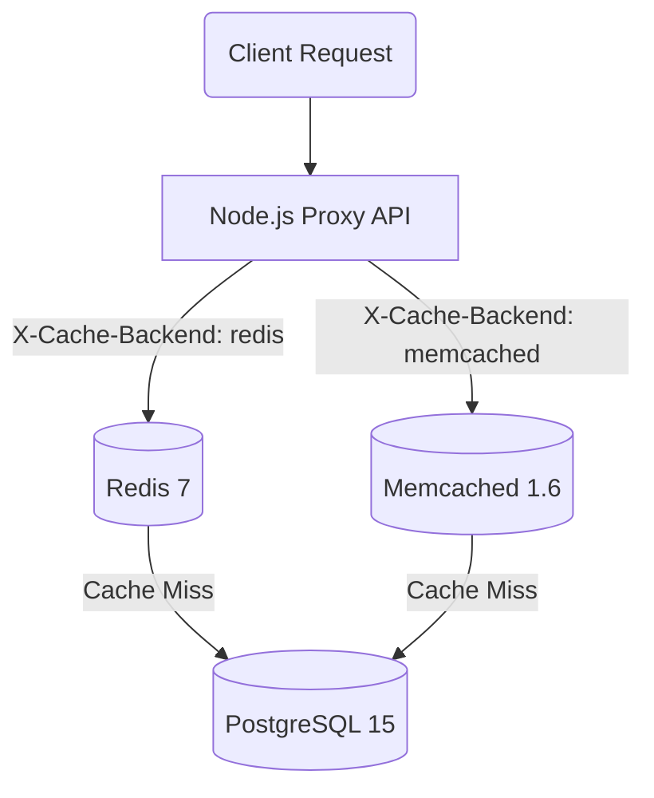
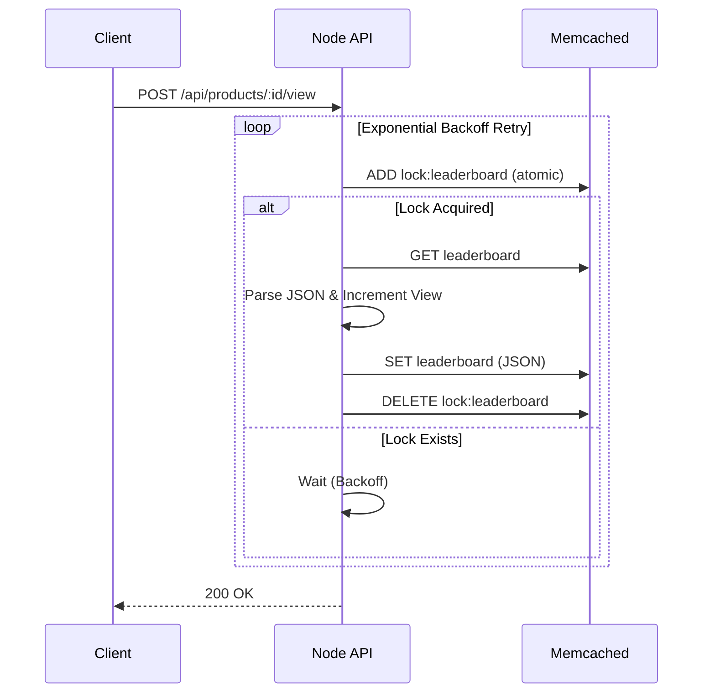

# comparative-caching-layer

A high-performance product catalog API proxying requests to **Redis 7** and **Memcached 1.6**, implementing advanced caching patterns, distributed locking, pub/sub invalidation, rate-limiting, and microservice benchmarking.

---

## 📊 Memory Comparison

Below is the reported memory usage and overhead for storing **100,000 product objects** (averaging ~2KB each):

| Storage Backend | Reported Used Memory (MB) | Overhead per Key (Bytes) |
| :--- | :---: | :---: |
| **Redis 7** | 201.68 MB | 2114.73 Bytes |
| **Memcached 1.6** | 51.54 MB | 540.39 Bytes |

> [!NOTE]
> **Key Insight:** Memcached exhibits almost **4x lower** memory overhead per key compared to Redis. This is due to Memcached's lean, multi-threaded slab allocation design which stores raw values, whereas Redis wraps values in `robj` structures, uses hash tables with `dictEntry` overhead, SDS (Simple Dynamic Strings), and maintains complex internal type descriptors.

---

## 🚀 Architectural Design & Patterns

### 1. Backend Strategy Switching
The proxy checks the incoming request's `X-Cache-Backend` header. If it is `redis`, the application targets Redis; if `memcached`, it routes to Memcached.



### 2. Leaderboard view updates
- **Redis**: Uses Sorted Sets (`ZSET`) via native atomic `ZINCRBY` commands. Sorting is offloaded to the database engine and executed in $O(\log N)$ time.
- **Memcached**: Memcached is a flat key-value store and does not support sorting. The leaderboard is managed as a serialized JSON list of items. To prevent race conditions during the *Read -> Modify -> Write* sequence, we implemented a distributed locking pattern using the atomic `add` command (set if not exists) with exponential backoff retries.



### 3. Rate Limiter (100 req/min)
- **Redis**: Employs an atomic Lua script executing `INCR` and conditional `EXPIRE` in a single network round-trip.
- **Memcached**: Executes `incr`. If the key does not exist, it falls back to a safe atomic `add` initialization to eliminate race conditions between concurrent worker threads.

### 4. Cache Invalidation
- **Redis**: Performs `DEL` and uses standard `PUBLISH` to broadcast the invalidation event to other proxy application processes.
- **Memcached**: Implements **Cache Versioning**. A global `product_version` key is incremented, effectively invalidating all current product cache keys by mutating their key prefixes (`v<version>:product:<id>`).

---

## ⚡ Concurrency & Benchmark Findings

### Concurrency Stress Test (Race Test)
Our consistency verification script (`npm run race-test`) spawns **10 concurrent clients** making **100 requests each** (1000 total) to increment a product's views:
- **Redis (ZINCRBY)**: **0** lost increments (exactly 1000 views recorded) due to atomic event-loop execution.
- **Memcached (With Lock)**: **0** lost increments (exactly 1000 views recorded) due to the distributed locking wrapper.
- **Memcached (No Lock - Naive)**: **1000** lost increments (0 views recorded or heavily corrupted) due to overlapping read-modify-write transactions overwriting each other.

### Raw Cache Performance (memtier_benchmark - Pipeline Depth 1)
- **Redis (P1)**: ~76,480 Ops/sec | p99 Latency: ~0.415 ms
- **Memcached (P1)**: ~53,727 Ops/sec | p99 Latency: ~0.687 ms

---

## 🛠️ Getting Started

### 1. Build and Run the Stack
To build the API and seed 100,000 product rows into Postgres, run:
```bash
docker-compose up -d --build
```
Verify health:
```bash
docker ps
```

### 2. Run Benchmarks
Run memtier_benchmark tests:
- On Linux/Unix:
  ```bash
  bash run_benchmarks.sh
  ```
- On Windows PowerShell:
  ```powershell
  powershell -ExecutionPolicy Bypass -File .\run_benchmarks.ps1
  ```

### 3. Run Consistency Race Tests
Run local concurrency stress tests:
```bash
npm run race-test
```
This updates the final `submission.json` output file.

### 4. Testing Endpoints Manually
**Linux / macOS / Git Bash:**
```bash
curl -H "X-Cache-Backend: redis" http://localhost:3000/api/products/1000
curl -H "X-Cache-Backend: memcached" http://localhost:3000/api/products/1000
```

**Windows PowerShell:**
*Note: In PowerShell, `curl` is an alias for `Invoke-WebRequest`. Use `curl.exe` to use the actual curl binary.*
```powershell
curl.exe -H "X-Cache-Backend: redis" http://localhost:3000/api/products/1000
curl.exe -H "X-Cache-Backend: memcached" http://localhost:3000/api/products/1000
```
