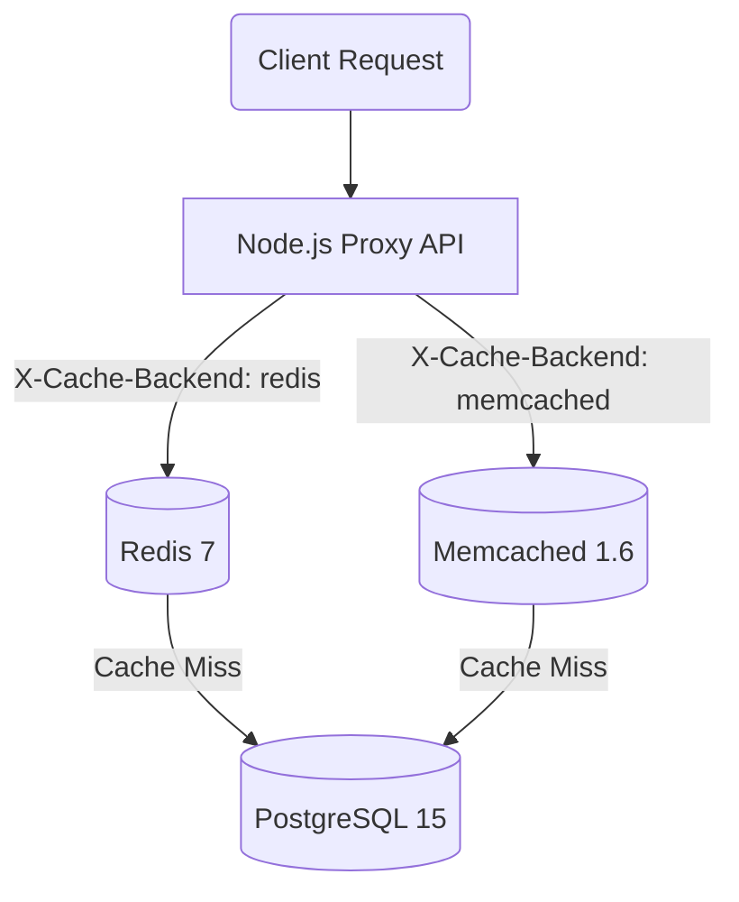
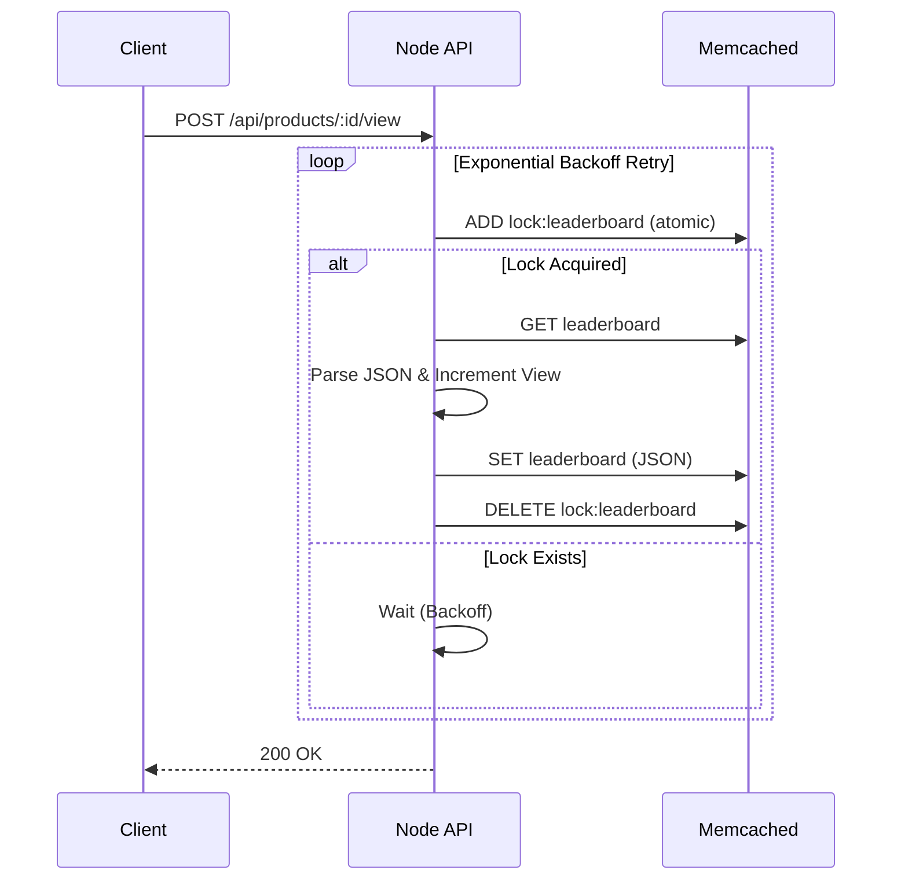

# Architectural Design & Patterns

This application acts as a proxy API that dynamically routes caching requests to either **Redis 7** or **Memcached 1.6**.

## 1. Backend Strategy Switching
The proxy checks the incoming request's `X-Cache-Backend` header.

## 2. Leaderboard Concurrency & Consistency

### Redis Implementation
Redis provides native Sorted Sets (`ZSET`). We use the `ZINCRBY` atomic command to increment views and maintain the leaderboard simultaneously. Sorting is offloaded to the database engine and executed in $O(\log N)$ time.

### Memcached Implementation
Memcached does not support sorting or complex types. The leaderboard is managed as a serialized JSON list. To prevent race conditions during the *Read -> Modify -> Write* sequence, we implemented a distributed locking pattern.

## 3. Rate Limiter (100 req/min)
- **Redis**: Employs an atomic Lua script executing `INCR` and conditional `EXPIRE` in a single network round-trip.
- **Memcached**: Executes `incr`. If the key does not exist, it falls back to a safe atomic `add` initialization.

## 4. Cache Invalidation
- **Redis**: Performs `DEL` and uses standard `PUBLISH` to broadcast the invalidation event.
- **Memcached**: Implements **Cache Versioning** via a global `product_version` key.
